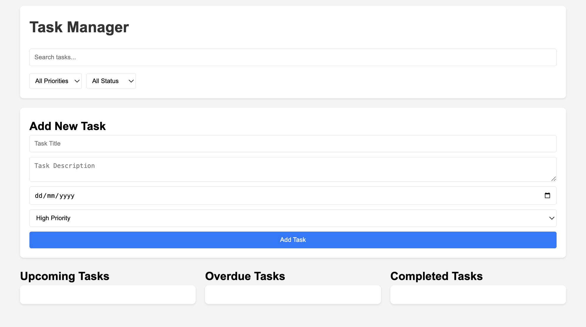
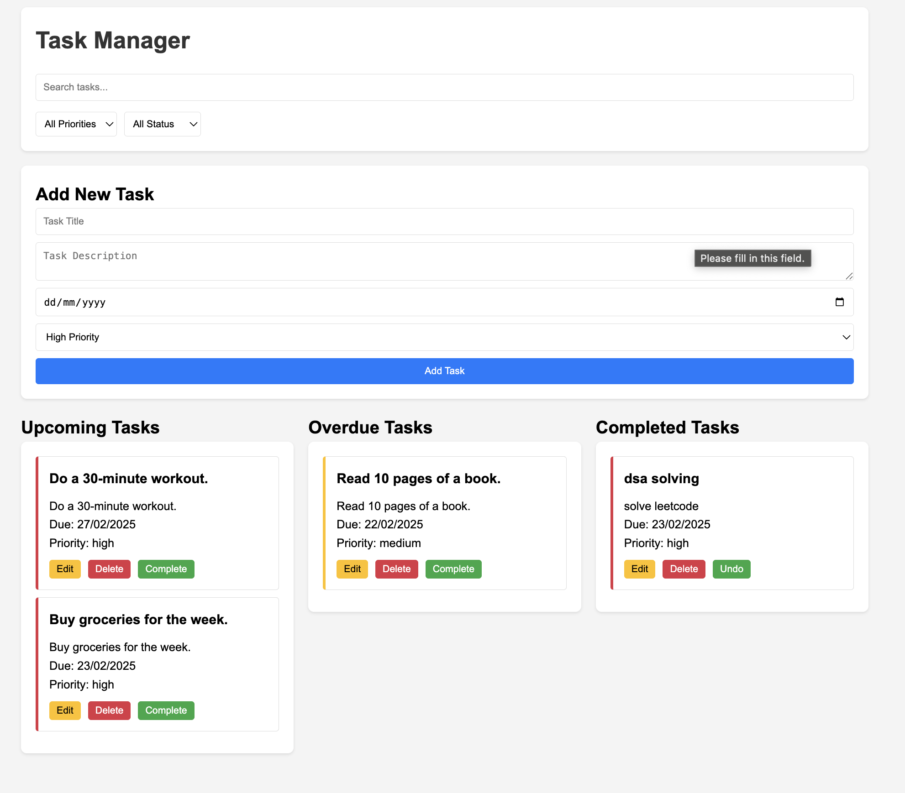

# Task Manager

A modern task management application built with vanilla JavaScript. Organize tasks with priorities, due dates, and real-time filtering.

## Screenshots

### Dashboard

### Task Management

## Features

- ✅ Create, edit, and delete tasks
- 📅 Set due dates and priority levels
- 🔄 Track task completion status
- 🔍 Search and filter tasks
- 📱 Responsive design
- 💾 Local storage persistence

## Quick Start

1. Clone the repository:
 ⁠bash
git clone https://github.com/ishita3490/Task-management.git

2. Open with Live Server in VS Code:
   - Install VS Code
   - Install "Live Server" extension
   - Right-click `index.html`
   - Select "Open with Live Server"

## Project Structure

task-manager/
├── index.html
├── css/
│   └── styles.css
├── js/
│   ├── app.js
│   ├── taskManager.js
│   └── utils.js
└── README.md

## Usage

### Adding Tasks
- Fill in task details (title, description, due date, priority)
- Click "Add Task"

### Managing Tasks
- Edit: Click ✏️ button
- Delete: Click 🗑️ button
- Complete/Uncomplete: Click ✓ button

### Search & Filter
- Use search bar for title/description search
- Use dropdowns to filter by priority and status

## Technologies

- HTML5
- CSS3 (Flexbox & Grid)
- Vanilla JavaScript
- LocalStorage
